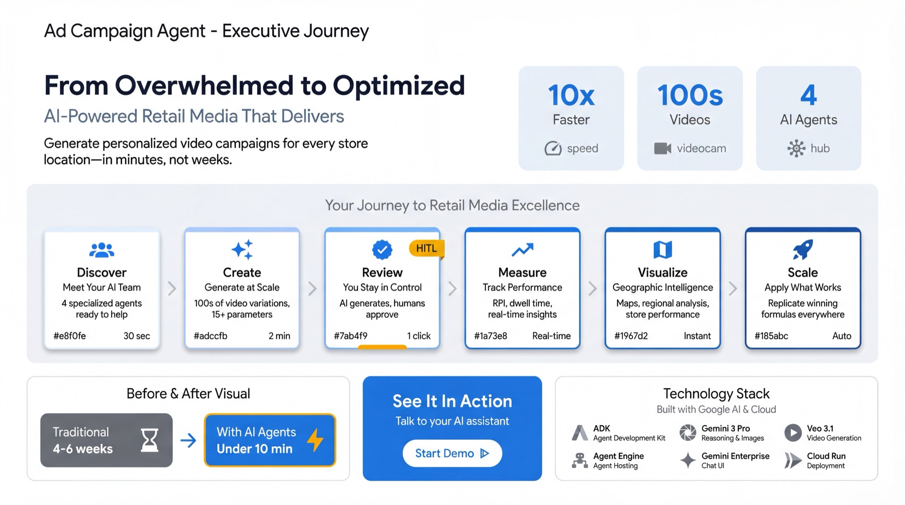

# Ad Campaign Agent - Demo Guide

A complete walkthrough for demonstrating the Ad Campaign Agent platform.

## Executive Journey



## Overview

This demo showcases an **AI-powered in-store retail media platform** built with Google's Agent Development Kit (ADK). The system demonstrates how multi-agent AI can transform retail advertising from creative ideation to performance optimization.

**Key Value Propositions:**

- **10x faster creative production** - Generate video variations in minutes, not weeks
- **Human-in-the-Loop (HITL) control** - AI assists, humans approve
- **Data-driven optimization** - Apply winning formulas across campaigns
- **Geographic intelligence** - Store-level performance with Google Maps integration

## Demo Duration

| Version | Time | Notes |
|---------|------|-------|
| Full Demo | 20-25 min | All 6 acts |
| Core Demo | 15 min | Skip optional scenes |
| Quick Overview | 5 min | Acts 1 + 4 only |

**Audience:** Retail Media Executives, Marketing Leaders, Technical Decision Makers

---

## The Story

> *"You're the Director of Retail Media for a fashion retailer with stores across the US. Holiday season is approaching, and you need to launch personalized video campaigns for each store location - but your creative team is overwhelmed. Let's see how AI agents can help..."*

---

## Pre-Demo Checklist

- [ ] ADK Web UI running (`adk web app` or Cloud Run URL)
- [ ] Product images available in GCS at `product-images/`
- [ ] `GOOGLE_MAPS_API_KEY` set (for static maps)
- [ ] Test one video generation to warm up models
- [ ] Clear browser cache for artifact viewing

---

## Act 1: Understanding the Platform (2 min)

### Scene 1.1: Meet the Multi-Agent System

**Query:**

```text
What agents are available and what are our current campaigns?
```

**What to Highlight:**

- Coordinator routes to 4 specialized agents
- Product-centric model: Each campaign = 1 product + 1 store
- Pre-loaded with 4 demo campaigns

---

### Scene 1.2: Browse the Product Catalog

**Query:**

```text
Show me all available products with their image links
```

**What to Highlight:**

- 22 products across 5 categories
- Clickable `image_url` links to view products
- Each product ready for video generation

---

## Act 2: Creative Generation with AI (5-6 min)

### Scene 2.1: Explore Variation Options

**Query:**

```text
What variation presets do I have for video generation?
```

**What to Highlight:**

- Diversity presets (model ethnicities)
- Setting presets (studio, beach, urban, cafe, etc.)
- Mood presets (elegant, romantic, bold, playful)
- These enable A/B testing

---

### Scene 2.2: Generate a Video

**Query (Use existing campaign):**

```text
Generate a video for campaign 2 with a European model on a rooftop at sunset, with a sophisticated elegant mood
```

**Query (Create new campaign):**

```text
Create a campaign for the sage-satin-camisole at our Miami Beach store, then generate a video with a Latina model on a beach at golden-hour, romantic serene mood
```

**What to Highlight:**

- **Two-stage pipeline**:
  1. Stage 1: Gemini generates scene image
  2. Stage 2: Veo 3.1 animates into 8-second video
- Video starts in "generated" status (pending review)

**Demo Tip:** While generating (~2-3 min), explain:

> "The AI first creates a scene image showing a model wearing our product, then animates it into a cinematic video."

---

### Scene 2.3: Batch Generate Variations

**Query:**

```text
Generate three video variations for campaign 2:
1. African model in studio with dramatic lighting, bold energy
2. Asian model in cafe setting, warm sophisticated mood
3. European model walking in urban street at day, dynamic energy
```

**What to Highlight:**

- Batch generation for efficiency
- Each variation named descriptively
- All pending review before going live

---

### Variation Parameters Reference

| Category | Options |
|----------|---------|
| Model | asian, european, african, latina, south-asian, middle-eastern, diverse |
| Setting | studio, beach, urban, cafe, rooftop, garden, nature, office, street |
| Mood | elegant, romantic, bold, playful, sophisticated, mysterious, serene |
| Lighting | natural, studio, dramatic, soft, golden, neon, moody |
| Time | golden-hour, sunrise, day, sunset, dusk, night |
| Activity | walking, standing, sitting, dancing, spinning, posing, running |
| Camera | orbit, pan, dolly, static, tracking, crane, handheld |

---

## Act 3: Human-in-the-Loop Review (4-5 min)

### Scene 3.1: The Review Table

**Query:**

```text
Show me the video review table with public links
```

**What to Highlight:**

- Card-based format with full details
- **Clickable WATCH VIDEO links** for preview
- Emphasize: "Nothing goes live without human approval"

---

### Scene 3.2: Batch Activation

**Query:**

```text
Activate videos 5 and 7
```

**What to Highlight:**

- Batch activation with `activate_batch([5, 7])`
- Status changes to "activated"
- **30 days of metrics generated** on activation
- Metrics only start after human approval

---

### Scene 3.3: Pause and Archive (Optional)

**Query:**

```text
Pause video 6 temporarily
Archive video 8
```

**What to Highlight:**

- Full lifecycle control: generated -> activated -> paused -> archived
- Paused videos preserve metrics history

---

## Act 4: Analytics & Optimization (4-5 min)

### Scene 4.1: Campaign Metrics

**Query:**

```text
Get metrics for campaign 2 over the last 30 days
```

**What to Highlight:**

- **In-store retail media metrics** (not digital):
  - Impressions: Ad displays on in-store screens
  - Dwell Time: Seconds shoppers viewed the ad
  - Circulation: Foot traffic past display
  - **RPI (Revenue Per Impression)**: Primary KPI
- Weekend patterns visible (40% higher)

---

### Scene 4.2: Generate Charts

**Query:**

```text
Generate a trendline chart showing revenue per impression for campaign 2 over 30 days
```

**Alternative Queries:**

```text
Create a bar chart of weekly impressions for campaign 3
Generate a comparison KPI card for campaign 1
Create an infographic visualization of campaign 2 performance
```

**What to Highlight:**

- AI-generated charts using Gemini
- Anti-hallucination: Uses ONLY real data
- Saved as artifact for download

---

### Scene 4.3: Compare Campaigns

**Query:**

```text
Compare all four campaigns side by side
```

**What to Highlight:**

- Side-by-side metrics comparison
- Rankings by RPI and total revenue
- Identifies winner with explanation

---

## Act 5: Geographic Intelligence (3-4 min)

### Scene 5.1: Campaign Map

**Query:**

```text
Show me all campaign locations with Google Maps links
```

**What to Highlight:**

- Clickable Google Maps URLs for each store
- Performance metrics per location

---

### Scene 5.2: Generate Map Visualization

**Query:**

```text
Generate a performance map showing all campaigns on a US map in infographic style
```

**What to Highlight:**

- AI-generated infographic using Gemini
- Revenue bubbles sized by performance
- Regional summary panel

---

### Scene 5.3: Regional Comparison

**Query:**

```text
Generate a regional comparison map showing West Coast vs East Coast RPI
```

---

## Act 6: Apply Winning Formula (2 min)

### Scene 6.1: Scale Success

**Query:**

```text
Apply the winning formula from video 5 to campaign 3
```

**What to Highlight:**

- Extracts winning characteristics: mood, setting, lighting, camera
- Applies to different product at different location
- New video generated with proven approach

---

## Closing: Value Summary

**Key Points:**

1. **Multi-Agent Collaboration** - 4 specialized agents working together
2. **Product-Centric Campaigns** - Clear attribution per product per store
3. **Creative at Scale** - Multiple video variations with AI
4. **Human Control** - HITL review and approval
5. **In-Store Analytics** - Retail-appropriate metrics
6. **Geographic Intelligence** - Google Maps integration
7. **Data-Driven Optimization** - Apply winning formulas

---

## Quick Reference: Demo Queries

### Campaign Management

```text
List all campaigns
Show me campaign 2 details
Create a campaign for the sage-satin-camisole at our Miami Beach store
What campaigns are in draft status?
```

### Product Browsing

```text
Show me all available products with their image links
List products in the dress category
Show me outerwear products with URLs
```

### Video Generation

```text
What variation presets are available?
Generate a video for campaign 2 with a European model on a rooftop at sunset
Generate 3 variations for campaign 3 with different settings
```

### HITL Review

```text
Show me the video review table with public links
Activate videos 5 and 7
Pause video 6
What's the status of video 5?
```

### Analytics

```text
Get metrics for campaign 2 over the last 30 days
Top 5 videos by RPI
Compare campaigns 1, 2, 3, 4
Generate a trendline chart for campaign 1
```

### Maps

```text
Show me all campaign locations with Google Maps links
Generate a performance map showing all campaigns
Generate a regional comparison map
```

### Optimization

```text
Apply winning formula from video 5 to campaign 3
Get video properties for video 5
```

---

## Campaign Reference (Pre-loaded)

| ID | Product | Store | City |
|----|---------|-------|------|
| 1 | Blue Floral Maxi Dress | Westfield Century City | Los Angeles, CA |
| 2 | Elegant Black Cocktail Dress | Bloomingdale's 59th Street | New York, NY |
| 3 | Black High Waist Trousers | Water Tower Place | Chicago, IL |
| 4 | Emerald Satin Slip Dress | The Grove | Los Angeles, CA |

---

## Troubleshooting

| Issue | Solution |
|-------|----------|
| "No metrics" for campaign | Videos must be activated first |
| Video generation slow | Normal - Veo 3.1 takes 2-3 minutes |
| Chart not showing data | Check that campaign has activated videos |
| Static map API error | Set `GOOGLE_MAPS_API_KEY` or use AI-generated map |
| Video links show gs:// URLs | Add "with public links" to query |

---

## Models Used

| Purpose | Model |
|---------|-------|
| All Agents | `gemini-3.5-flash` |
| Scene Images | `gemini-3-pro-image` |
| Video Animation | `veo-3.1-generate-001` |
| Charts/Maps | `gemini-3-pro-image` |

---

## Environment Variables

| Variable | Purpose | Required |
|----------|---------|----------|
| `GOOGLE_CLOUD_PROJECT` | GCP project | Yes |
| `GCS_BUCKET` | Cloud Storage bucket | Yes |
| `GOOGLE_MAPS_API_KEY` | Static Maps API | Optional |

---

## Workstream Testing Journeys

Owner manual-testing journeys for changes landed by version-2 workstreams (rule as of 2026-07-22: every workstream that changes agent-visible behavior adds its journeys here, in the root demo guide). Copy-paste prompts/commands + expected results.

### Workstream 11a — APP_MODE and the audience-data seam

Phase 11a put demo-data generation behind a real seam: an `AudienceDataSource`
interface with `SyntheticAudienceDataSource` (the demo generator, wrapped as-is)
as the only registered implementation, resolved by `APP_MODE` through a
fail-closed factory. This is a refactor, not a behavior change — demo mode's
output is byte-identical by design (golden-pinned against the pre-refactor join).

#### Journey 11a.1 — demo mode unchanged

```bash
make dev
```

Re-run any metrics journey (e.g. Act 4 Scene 4.1) — expect **identical numbers**
to before this workstream. If anything differs, the seam refactor broke
byte-identity and that's a regression, not an intentional change.

#### Journey 11a.2 — connected mode fails closed (terminal check, no browser needed)

```bash
APP_MODE=connected .venv/bin/python -c \
  "from app.audience import get_audience_datasource; get_audience_datasource()"
```

**Expect:** a `RuntimeError` whose message names `APP_MODE='connected'`, Phase
11b (the live BlueZoo adapter that isn't implemented yet), and the way back
(`APP_MODE=demo`, the default). In the app, any flow that derives metrics
(video activation, demo-data seeding) raises this same error in connected mode
instead of silently falling back to demo data — the fail-closed principle from
Phase 6, now real rather than deferred.

#### Journey 11a.3 — invalid APP_MODE still rejected at startup

```bash
APP_MODE=banana make dev
```

**Expect:** a `ValueError` at config load (unchanged behavior — predates ws11a).
These are two different layers: an invalid `APP_MODE` value fails at **config
load** (`ValueError`), while a valid-but-unimplemented value (`connected`) fails
at **datasource resolution** (`RuntimeError`) the first time something actually
needs audience data.

### Workstream 15 — local-first storage, gated seeding, product onboarding

Phase 15 made the app local-first (GCS is now an explicit opt-in: `GCS_BUCKET`
unset ⇒ every asset lives under the project root and tool responses never
contain `storage.googleapis.com` URLs), added `DEMO_DATASET=fashion|none` to
gate demo seeding, and put three product-onboarding tools on the Campaign agent
(`create_product`, `import_products_from_folder`, `generate_product_image`)
plus a CLI twin (`scripts/onboard_products.py`) and a Drive-hosted demo-asset
bundle (`scripts/demo_assets.py`). **Check your `app/.env` first:** if it still
sets `GCS_BUCKET`, you are in GCS mode — comment that line out for these
journeys.

#### Journey 15.1 — from-scratch onboarding on an empty catalog

```bash
make reset-db
DEMO_DATASET=none make dev
```

Then in the chat, in order:

1. `Show me all products in the catalog` — **expect** `list_products` reports
   **0 products** (empty catalog, nothing seeded).
2. `Add a new product: Aurora Cold Brew 330ml, category beverage, a nitro cold
   brew in a slim can, 330ml volume` — **expect** routing to the **Campaign
   agent** and `create_product` returning success with
   `image_status: "pending"`.
3. `Generate a product image for Aurora Cold Brew` — **expect**
   `generate_product_image` to run (real image-model call, ~30–90s), the image
   to render inline as an artifact, and `image_status: "available"` — with
   **no** `image_url` field (local mode has no public URLs).
4. `Create a campaign for Aurora Cold Brew at Demo Store in Austin, Texas` —
   **expect** a campaign named like "Aurora Cold Brew 330Ml - Demo Store".

Full scripted version with per-scene assertions:
`docs/demo-scenarios/from-scratch-onboarding.md`.

#### Journey 15.2 — default demo unchanged, minus dead links

```bash
make reset-db
make dev
```

**Expect:** the full fashion demo seeds as always (22 fashion + 6 retail-core
products, 4 campaigns) — `DEMO_DATASET` defaults to `fashion`. Browse products:
each item now carries `image_status` (`"available"`/`"missing"`); locally the
seeded catalog shows `"missing"` until you install the demo-asset bundle
(Journey 15.4) — what's gone is the old behavior of emitting
`storage.googleapis.com` links that may or may not resolve. Metrics journeys
(e.g. Act 4) are numerically unchanged.

#### Journey 15.3 — CLI onboarding (terminal, no browser needed)

```bash
.venv/bin/python -m scripts.onboard_products create \
  --name "Trail Shoe X" --category footwear --attr weight_grams=240
.venv/bin/python -m scripts.onboard_products import-folder ~/my-product-photos \
  --category homeware
```

**Expect:** JSON results identical in shape to the agent tools' responses (the
CLI calls the very same functions); duplicates are skipped with a message, and
imported images land under `product-images/` in the project root.

#### Journey 15.4 — demo-asset bundle install (and graceful skip)

```bash
make demo-assets
```

(`make dev` also runs this automatically before starting the server; a local
zip installs via `make demo-assets-from-file FILE=<bundle.zip>`.)

**Expect (today, no Drive ID configured):** a graceful skip —
`"Demo asset bundle not configured"` — and the app keeps working. Once a
bundle is published and `DEMO_ASSETS_DRIVE_ID` is set in `app/.env`, the same
command downloads, sha256-verifies, and installs the demo product images into
`product-images/`; a second run reports already-installed. Building/publishing
the bundle (`make demo-assets-build SRC=<folder>`) is documented in
`SETUP_INSTRUCTIONS.md` ("Demo asset bundle").

### Workstream 14

#### Journey 14.1 — agent default model is gemini-3.6-flash

```bash
.venv/bin/python -c "from app import config; print(config.MODEL)"
```

**Expect:** `gemini-3.6-flash` (override still via `AGENT_MODEL` in `app/.env`).
Then in the web UI ask: **"Show me all my campaigns"** — expect routing to the
Campaign Agent's `list_campaigns` exactly as before (the flip changes the
model, not the routing contract; F1 Scene 1 is the full check).

### Workstream 16 — live-API test tier, dup-product fix, Maps-routing fix

Phase 16 added a second, real-money test tier (`make test-live`: agent-routing
evals + live Veo/image-gen media + a Gemini multimodal judge) alongside two
agent-behavior fixes it surfaced and fixed along the way: campaign creation no
longer onboards a duplicate product when the requested product already exists
in the catalog, and Google-Maps-link queries now route to the Analytics Agent
instead of the Campaign Agent. See `CLAUDE.md`'s Commands tier map and
`SETUP_INSTRUCTIONS.md`'s "Live tier" section for setup/cost/flakiness notes.

#### Journey 16.1 — fast tier still seconds, zero LLM calls

```bash
make test
```

**Expect:** unit + e2e only (integration moved out of the default target this
workstream) — hundreds of tests, seconds, zero network/LLM calls. This is the
loop that runs after every edit (the `PostToolUse` hook runs `make test-unit`
specifically).

#### Journey 16.2 — live tier, real APIs, ~11 minutes

```bash
make test-live
```

**Expect:** requires `app/.env` with working Vertex credentials (the target
exits with an error if the file is missing) and `google-adk[eval]==2.5.0`
installed into `.venv` (`SETUP_INSTRUCTIONS.md` has the install command — this
extra is not in `app/requirements.txt`). A clean run is **26 passed / 0
failed** in roughly **11 minutes**, and makes real Vertex/Veo/image-model
calls the whole way — expect real billing. If a case fails, rerun once before
treating it as a regression: the "Live tier" section in
`SETUP_INSTRUCTIONS.md` documents three known flaky (not broken) surfaces —
a transient Vertex `400`, LLM-judge nondeterminism, and a transient Veo
generation error.

#### Journey 16.3 — deliberate-break check (proves the live tier actually catches regressions)

```bash
# Corrupt an eval set's expected tool name, e.g. in
# tests/integration/eval_sets/coordinator.test.json change
# "list_campaigns" to "list_campaignsX" in one case's tool_uses, then:
.venv/bin/pytest tests/integration -k coordinator -v --tb=short
# Expect: that case FAILS on the tools and trajectory dimensions.
# Revert the edit and re-run — expect it passes again.
```

This is the check that originally exposed the pre-ws16 vacuity (a "pass" was
possible with zero real inferences); it must now be impossible to fake — a
wrong expectation always fails the live run.

#### Journey 16.4 — reading a judge/grade report (informational, not a gate)

```bash
make test-live-report
```

**Expect:** requires `agents-cli` on PATH (`uv tool install google-agents-cli`)
in addition to the live-tier prerequisites above. Records fresh actuals for
`tests/integration/eval_sets/review_agent.test.json` (override with
`EVAL_SET=...`), converts them to an `agents-cli eval grade` trace, and writes
a report under `artifacts/grade_results/` (gitignored). This is a secondary,
**informational** cross-check over the same live traces the harness already
gates on — `tool_use_quality_v1` agrees with the harness's tools/trajectory
verdicts; `final_response_quality_v1` is not reliable yet (recorder doesn't
capture tool return values) and isn't a pass/fail signal. See
`.docs/version2-plan/working-docs/16-live-api-testing/research/agents-cli-architecture.md`
for the full fit verdict.

#### Journey 16.5 — Maps-link queries route to the Analytics Agent

```bash
make dev
```

Ask: **"Show me all campaign locations with Google Maps links"** (this is
Act 5 Scene 5.1's query, unchanged). **Expect:** routing to the **Analytics
Agent**'s `get_campaign_map_data` (not the Campaign Agent) — the response
lists each campaign's store with a clickable Google Maps link. Contrast with
**"Show me all store locations"** (no "Maps"/"links" wording), which still
routes to the **Campaign Agent**'s `get_campaign_locations` and answers with
plain city/state, no map links — that split is the fix.

#### Journey 16.6 — creating a campaign for a product that already exists reuses it

```bash
make dev
```

Ask: **"Create a campaign for the Aurora cold brew at Target Downtown in
Austin, Texas"** (Aurora Cold Brew 330ml is one of the seeded retail-core
products). **Expect:** the agent calls `list_products` first, finds the
existing product, and calls `create_campaign` directly with that product's ID
— **no** `create_product` call, and the confirmation notes it reused the
existing product rather than creating a duplicate. Before this workstream's
fix the agent onboarded a brand-new duplicate "Aurora Cold Brew" product
instead of reusing the existing one.

### Workstream 11b — connected mode (live BlueZoo)

Phase 11b implemented `LiveBlueZooAudienceDataSource`
(`app/audience/live_bluezoo.py`) — the connected-mode conformer that the ws11a
seam resolves to when `APP_MODE=connected`, reading real audience-visit rows
from BlueZoo's MO_92 Data Warehouse (`run_query` over `sensor_visits`) in
place of the synthetic demo generator. Demo mode (`APP_MODE=demo`/unset) is
byte-identical — nothing here invalidates any earlier journey; these are
additive. Full scripted version with per-scene assertions:
`docs/demo-scenarios/connected-bluezoo.md`.

#### Journey 11b.1 — connected-mode setup: building the sensor map

Connected mode needs three things beyond `app/.env`'s existing Vertex vars:
`BLUEZOO_BASE_URL` and `BLUEZOO_ACCESS_KEY` (the cluster-scoped MO_92 pair —
put these in `app/.env`, never on a command line or in a tracked file) and
`BLUEZOO_SENSOR_MAP` (a `screen_id:sensor_id` list built from a real
campaign's screen roster).

```bash
.venv/bin/python -c \
  "from app.demo_data.attribution import screens_for_campaign; print(screens_for_campaign(1))"
```

**Expect:** `[101, 102, 103]` — campaign 1's three screens. Map them onto the
verified, currently-valid, full-coverage BlueZoo sensors from Task 6 Step 0
(provenance: `tests/unit/data/bluezoo_sensor_visits_sample.md` — sensors
chosen from evidence of real recent valid rows, not guessed ids, so a scene
failure means code, not a dark/never-commissioned sensor):

```
BLUEZOO_SENSOR_MAP=101:77,102:80,103:89
```

#### Journey 11b.2 — happy path: metrics from real MO_92 rows

```bash
APP_MODE=connected BLUEZOO_SENSOR_MAP=101:77,102:80,103:89 make dev
```

(`BLUEZOO_BASE_URL`/`BLUEZOO_ACCESS_KEY` come from `app/.env`.) In the chat:
activate a pending video for campaign 1 (insert one first if the seeded DB
has none — see `docs/demo-scenarios/connected-bluezoo.md` Scene 2 for the
`sqlite3 INSERT`), then ask for that campaign's metrics.

**Expect:** the activation and metrics tools both succeed, and the terminal
running `make dev` prints a line of this exact shape (logger
`app.audience.live_bluezoo`):

```
bluezoo live read: policy=valid-only sensors=[77, 80, 89] window=<from>..<to> rows=<n>
```

with `rows=` > 0 — that log line is the proof the numbers came from BlueZoo,
not the synthetic generator. Reported impressions will differ from what the
same video would show under `APP_MODE=demo`, since they derive from real
float interval counts joined through attribution rather than the
deterministic seeded generator.

#### Journey 11b.3 — fail-closed: missing BlueZoo config

```bash
APP_MODE=connected make dev
```

(leave every `BLUEZOO_*` var unset). Activate a pending video for campaign 1
as above.

**Expect:** the activation tool call fires, but its response/trace carries a
`BlueZooConfigError` naming both missing variables — look for these exact
fragments: `"APP_MODE=connected requires BLUEZOO_BASE_URL and
BLUEZOO_ACCESS_KEY"`, `"cluster-scoped pair"`, `"SETUP_INSTRUCTIONS.md"`. The
video's status stays `generated` in `campaigns.db` — no metrics are silently
synthesized from demo data. A success response or any metrics numbers here
would mean the fail-closed guarantee regressed.

#### Journey 11b.4 — policy knob: `BLUEZOO_VALID_POLICY=include-all`

```bash
APP_MODE=connected BLUEZOO_SENSOR_MAP=101:77,102:80,103:89 BLUEZOO_VALID_POLICY=include-all make dev
```

Repeat a metrics-affecting action (activate another pending video, or
re-generate metrics for the one from Journey 11b.2).

**Expect:** the same server log line, but with `policy=include-all` in place
of `policy=valid-only` — proof the knob is wired end to end (the SQL drops
its `and valid` clause). `BLUEZOO_VALID_POLICY` unset (or explicitly
`valid-only`) is the default; `rows=` may legitimately be unchanged for
sensors 77/80/89 specifically, since they were selected for having zero
`valid=false` rows in the verified capture window — this journey checks the
knob, not a metric delta.
