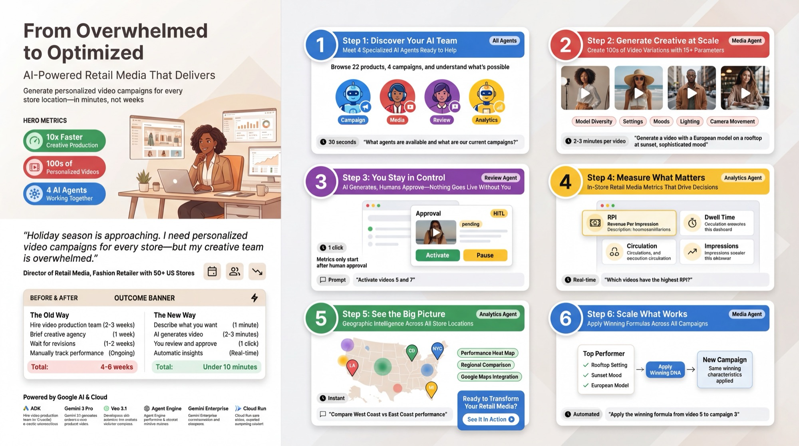

# video-ad-optimization-agent
Ad Campaign Agent with Google ADK (Agent Development Kit), VEO3 video synthesis, BlueZoo audience measurement.

<p align="center">
  <a href="./assets/use-case-poster.jpeg">
    
  </a>
</p>

Multi-agent platform for retail video advertising.

- **AI Video Generation** - Gemini + Veo 3.1 for professional ad content
- **Human-in-the-Loop** - Review and approval workflow
- **Analytics Dashboard** - In-store metrics with AI-generated charts

```bash
cd video-ad-optimization-agent && make install && make dev
```
