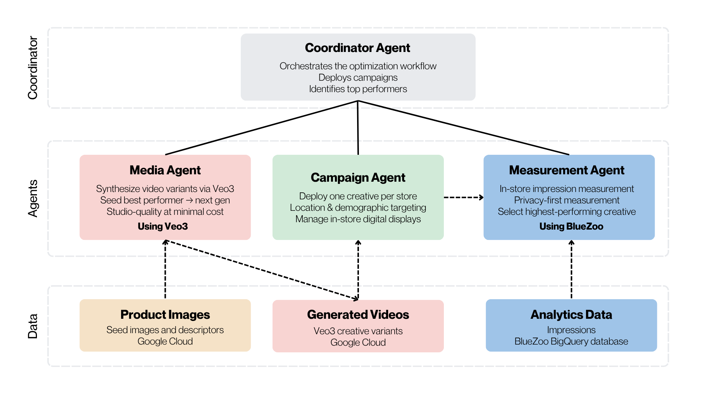
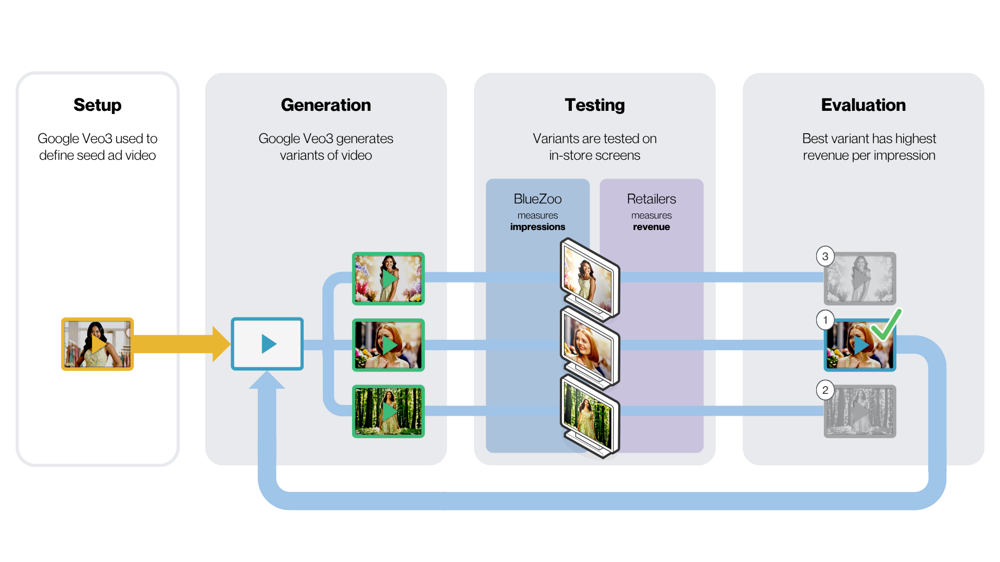

# video-ad-optimization-agent

# Higher performance in-store advertising starts with accurate audience data

Creating compelling video advertisements has never been easier. Knowing **which advertisements actually drive sales** is the harder problem.

The video advertising optimization agent, developed in collaboration between Google and BlueZoo, demonstrates how privacy-first audience measurement can be combined with the latest generative AI technologies to make in-store digital advertising deliver maximum lift at point-of-sale.

Using Google’s Veo3 AI tool for video synthesis, retailers can create multiple candidate video advertisements for every product in every demographic for less than the cost of a single studio-recorded video shoot. BlueZoo makes it possible to measure which advertisement performs best by allowing retailers to calculate “revenue per impression” (RPI) for each video creative. Retailers use BlueZoo impressions counts delivered for each video advertisement to normalize point-of-sale (POS) revenue by dividing advertised product revenue by the number of impressions delivered for that store’s ad during a day.

<p align="center">
  <a href="./assets/high-level-system.png">
    
  </a>
</p>

The best-performing creative becomes the seed for the next generation of Veo3-generated content, establishing a continuous optimization loop that delivers a more effective creative with every campaign cycle. Instead of relying on assumptions or lengthy creative cycles, retailers can rapidly generate, evaluate, and refine advertising using measurable business outcomes. The result is a faster, data-driven approach to creating more effective in-store advertising.

**Why This Matters**  
Traditional in-store advertising campaigns require significant time, creative resources, and production costs. Creating multiple versions of a product advertisement for different locations, audiences, or promotions is expensive and time-consuming, making it impractical to test which version works best.

Generative AI changes that by making it possible to create multiple targeted video campaigns for every product and store location in minutes, not weeks. Instead of investing heavily in a single creative concept, retailers can rapidly generate multiple variations, each tailored to specific products, promotions, locations, demographics, or customer segments. However, determining which creative actually influences purchasing behavior has traditionally required expensive manual testing or subjective decision-making.

By measuring real-time campaign performance, retailers can identify which creative delivers the greatest business impact. Those performance insights can then be fed back into the AI to generate even stronger creative, enabling a virtuous cycle of create-multiple-candidates → deploy-in-store → measure-performance → select-the-best → repeat. The result is faster campaign deployment, continuous improvement, and advertising that becomes more effective and cost-efficient over time.

**How It Works**  
The optimization workflow establishes a feedback loop:

1. Human specialist (from retailer or advertiser) uploads one or more seed images and video descriptors (setting, music, model, etc.) to create initial video iterations. (Submit videos for human review or submit to a “review agent”.)  
2. Automated campaign manager deploys video advertising in-store (one creative per store for one or more days) across in-store digital displays.  
3. BlueZoo sensors measure audience impressions (for one or more days).  
4. Retailers calculate revenue per impression by dividing each store’s POS revenue for each advertised product by the number of impressions delivered   
5. Agent identifies the highest-performing video advertisements.  
6. Agent generates new creative variations using Google's Veo3 video generation based on the highest performing advertisements.  
7. Continue at step 2 to improve campaigns over time through progressive optimization.

Instead of making creative decisions based on opinion, retailers can select advertising based on data.

<p align="center">
  <a href="./assets/executive-journey.png">
    
  </a>
</p>

**Why Google Veo3 Video Synthesis**  
Google Veo 3 video synthesis enables the rapid creation of studio-quality video advertisements, making it possible to generate personalized campaigns for every store location, promotion, or audience in minutes rather than weeks.

Google's AI ecosystem also provides tools to review content for brand compliance and corporate standards, automatically generate alternative creative variations, and orchestrate intelligent workflows that continuously improve campaign performance.

Without in-expensive, scalable content generation, testing multiple creative concepts would be too time-consuming and costly. Google's AI technologies make continuous creative optimization practical at enterprise scale.

**Why BlueZoo Audience Measurement**  
BlueZoo provides the impressions measurement capability that provides the data to the feedback loop, making optimization possible.

Our audience measurement platform delivers:

* Privacy-first impression and dwell time measurement  
* Scalable infrastructure for deployment across tens of thousands of digital screens  
* Mobile applications for measurement auditing that ensures data accuracy

Without reliable audience measurement, AI has no objective way to determine whether newly generated creative is actually performing better. BlueZoo closes that feedback loop.

**Demonstrated at InfoComm 2026**  
This project was developed collaboratively by BlueZoo and Google engineers as a technology demonstration for InfoComm 2026, building on the earlier demonstration first showcased at NRF 2026\.

The goal of the demonstration is to illustrate how audience measurement and generative AI can work together to create a continuous optimization cycle for in-store video advertising, helping retailers maximize advertising effectiveness while maintaining consumer privacy. While the demo at InfoComm 2026 used cached BlueZoo audience data and cached Veo3-generated video advertisements, this agent delivers the code for live connectivity to the Veo3 engine and BlueZoo’s BigQuery database recording real time audience analytics.

Although this repository demonstrates a specific implementation (clothing/fashion brands with human models), the underlying approach can be extended to a wide variety of retail media, digital signage, and in-store advertising applications.

**Learn More**  
To learn more about how to connect BlueZoo's audience measurement platform with this agent, visit [www.bluezoo.io](http://www.bluezoo.io).

For additional background on this demonstration, see the [accompanying announcement](https://www.bluezoo.io/bluezoo-demonstrates-how-googles-latest-ai-technologies-can-improve-the-sales-performance-of-in-store-video-advertising/).

```bash
cd video-ad-optimization-agent && make install && make dev
```
